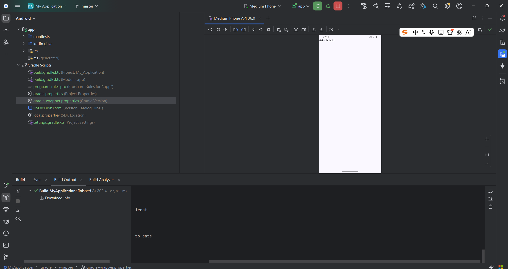
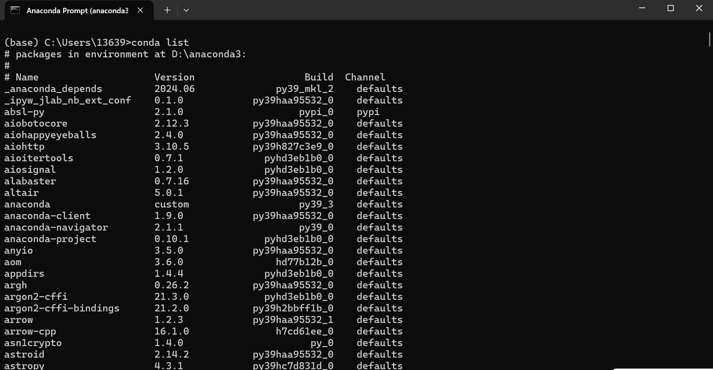

# 实验1：安装课程所需软件

## 一、实验目的

- 掌握 Android Studio 4.1+ 的安装与配置，能够新建并编译运行 Android 应用。
- 掌握 Jupyter Notebook 的安装（通过 Anaconda），并能创建和运行交互式笔记本。
- 掌握 Visual Studio Code 的安装及 Python、Jupyter 插件的配置。

## 二、实验环境

- 操作系统：Windows 11
- 网络：需要稳定网络以下载软件和依赖包
- 磁盘空间：至少 10 GB 可用空间

## 三、实验内容与步骤

### 3.1 安装 Android Studio

1. **下载安装包**  
   访问 [Android Studio 官网](https://developer.android.com/studio) 下载最新稳定版（Android Studio Panda 或更高版本，支持 LiteRT）。

2. **安装**  
   运行安装程序，按照向导完成安装。  
   - 安装路径避免中文和空格。  
   - 选择安装组件时，默认勾选 Android SDK、Android Virtual Device 等。

3. **首次配置**  
   - 启动 Android Studio，选择导入或新建配置。  
   - 在 SDK Manager 中确认 Android SDK 已安装。  
   - **配置阿里云 Maven 镜像**（加速 gradle 依赖下载）：  
     在项目级的 `build.gradle` 中添加：
     ```gradle
     allprojects {
         repositories {
             maven { url 'https://maven.aliyun.com/repository/public/' }
             maven { url 'https://maven.aliyun.com/repository/google/' }
             google()
             mavenCentral()
         }
     }

4. **新建并编译第一个应用**
    - 创建一个 “Empty Views Activity” 项目。
    - 点击 “Run” 按钮（或按 Shift+F10），第一次运行时会自动下载 Gradle 封装器和依赖库。
    - 等待编译完成，模拟器或真机成功运行出 “Hello World” 界面。

    

### 3.2 安装 Anaconda 与 Jupyter Notebook
-   **下载 Anaconda**  
    访问 [Anaconda 官网](https://www.anaconda.com/download) 下载 Windows 64-bit 安装包（Python 3.x 版本）。
-   **安装 Anaconda**
    
    -   运行安装程序，**安装路径不要包含中文、空格**。
    -   安装选项选择 “Just Me”（避免管理员权限问题）。
    -   勾选 “Add Anaconda to my PATH environment variable”（建议），或安装后手动添加。
    -   等待安装完成。
-   **验证安装**
    
    -   打开 “开始” 菜单 → Anaconda3 (64-bit) → Anaconda Navigator，能正常启动即成功。
    -   以管理员身份运行 “Anaconda Prompt”，输入 `conda list`，能看到包列表即成功。
-   **启动 Jupyter Notebook**
    
    -   在 Anaconda Navigator 中点击 Jupyter Notebook 下的 “Launch”。
    -   或直接在 Anaconda Prompt 中输入 `jupyter notebook`，浏览器会自动打开 Notebook 首页。
    -   新建一个 Python 3 笔记本，输入 `print("Hello Jupyter")` 并运行，验证环境正常。

    
    

### 3.3 安装 Visual Studio Code
-   **下载 VS Code**  
    访问 [VS Code 官网](https://code.visualstudio.com/) 下载安装包。
-   **安装**  
    运行安装程序，按默认选项安装（可勾选“添加到PATH”、“右键菜单”等便利选项）。
-   **安装必要插件**  
    启动 VS Code，打开扩展商店（Ctrl+Shift+X），安装以下插件：
    
    -   **Python**（Microsoft）
    -   **Jupyter**（Microsoft）
    -   **Jupyter Keymap**（可选，让快捷键更接近 Jupyter Notebook）
    
    

## 四、实验总结

通过本次实验，我成功安装了 Android Studio、Anaconda (Jupyter Notebook) 和 Visual Studio Code，并掌握了基本的使用方法。

-   Android Studio 的 gradle 加速配置对后续 Android 开发很有帮助。
-   Anaconda 方便地集成了科学计算包和 Jupyter，适合机器学习实验。
-   VS Code 通过插件生态也能完美支持 Jupyter 开发，提高了编码效率。

## 五、附件与代码仓库
本实验的 Markdown 文档已上传至 GitHub：
https://github.com/bukuujun/rk3/tree/master/sy1_1