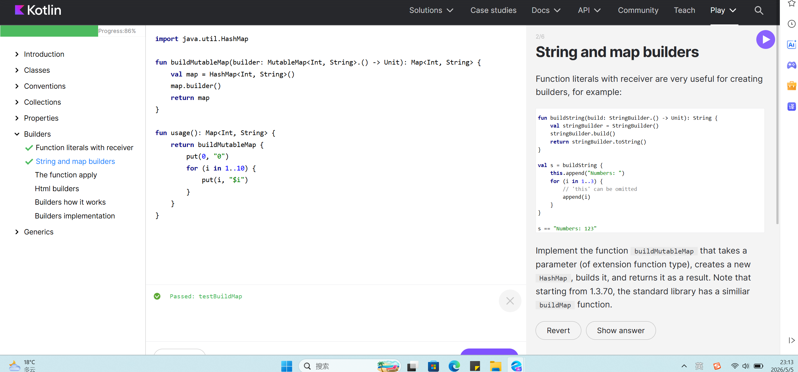

# 实验2_1：Kotlin 基本语法及练习

## 一、实验目的

- 掌握 Kotlin 的基本语法，包括变量声明、空安全、控制流、函数、Lambda 表达式和集合操作。
- 理解 Kotlin 相比 Java 的优势，如简洁性、空安全、函数式编程支持等。
- 能够使用 Kotlin 编写简单的 Android 风格代码，理解不可变状态、数据类等概念。
- 完成 Kotlin Koans 在线练习，达到 85% 以上的完成度。

## 二、实验环境

- 开发工具：Android Studio / Kotlin Playground（[在线环境](https://play.kotlinlang.org/)）
- 练习平台：[Kotlin Koans](https://play.kotlinlang.org/koans/overview)
- 操作系统：Windows 

## 三、实验内容与步骤

### 3.1 Kotlin 基础语法学习

#### 3.1.1 变量声明：val vs var

```kotlin
val appName = "AI Camera"  // 只读引用，不可重新赋值
var count: Int = 10        // 可变引用
count += 1
// appName = "New Name"    // 编译错误

-   **优先使用 `val`**：让状态更稳定，代码更易推理。
-   **类型推断**：多数场景下 Kotlin 能自动推断类型，但公共 API 建议显式声明类型。
```


#### 3.1.2 空安全

```kotlin
var title: String \= "Kotlin"
// var bad: String = null   // 编译错误
var subtitle: String? \= null  // 可空类型
subtitle \= "Android AI"
// 安全调用与 Elvis 运算符
val length \= subtitle?.length          // 如果为空则返回 null
val displayName \= subtitle ?: "Guest"  // 如果为空则返回默认值
// let 作用域
subtitle?.let {
    println("长度: ${it.length}")
}
```

-   默认类型不可为空，使用 `?` 标记可空类型。
-   使用 `?.`、`?:` 和 `let` 优雅处理空值。
-   **避免滥用 `!!`**，它会破坏空安全保护。

#### 3.1.3 控制流：if 与 when

```kotlin

// if 作为表达式
val level \= if (score \>= 90) "优秀" else "继续努力"
// when 表达式（替代 switch）
val result \= when (networkState) {
    "wifi" \-> "高速网络"
    "mobile" \-> "移动数据"
    else \-> "未知状态"
}
```

-   Kotlin 没有三元运算符，直接用 `if` 表达式即可。
-   `when` 支持区间、类型判断、多条件分支。

#### 3.1.4 循环与区间

```kotlin

// 区间遍历
for (i in 1..5) println(i)      // 1 2 3 4 5
for (i in 1 until 5) println(i) // 1 2 3 4
for (i in 10 downTo 1 step 2) println(i)
// 集合遍历
val users \= listOf("Ada", "Bob", "Cindy")
users.forEach { name \-> println("Hello, $name") }
```

#### 3.1.5 函数与默认参数

```kotlin

// 标准函数
fun greet(name: String): String \= "Hello, $name"
// 默认参数
fun predict(imagePath: String, threshold: Float \= 0.5f, verbose: Boolean \= false) {
    // ...
}
// 调用时使用命名参数
predict("test.jpg", verbose \= true)

```

#### 3.1.6 Lambda 与高阶函数

```kotlin

// Lambda 表达式：{ 参数 -> 函数体 }
val stringLength: (String) \-> Int \= { input \-> input.length }
// 高阶函数：参数中包含函数
fun stringMapper(str: String, mapper: (String) \-> Int): Int {
    return mapper(str)
}
val result \= stringMapper("Android") { it.length }  // it 是单参数的简写
```
-   Lambda 可以像数据一样传递。
-   Android 常见场景：点击事件、列表处理、异步回调。

#### 3.1.7 集合操作

```kotlin

val scores \= listOf(80, 90, 100)
val passed \= scores.filter { it \>= 90 }     // \[90, 100\]
val labels \= passed.map { "score=$it" }     // \["score=90", "score=100"\]
val modelInfo \= mapOf("name" to "LiteRT", "platform" to "Android")
println(modelInfo\["name"\])  // LiteRT
```

-   优先使用只读集合：`listOf()`、`mapOf()`。
-   使用 `filter`、`map`、`forEach` 等函数式操作，避免手写循环。

#### 3.1.8 类、数据类与单例

```kotlin

// 普通类（主构造函数直接写在类名后）
class Car(val brand: String, var speed: Int) {
    fun accelerate() { speed += 10 }
}
// 数据类（自动生成 toString、equals、hashCode、copy）
data class User(val id: Int, val name: String, val vip: Boolean)
// 单例对象
object Config {
    const val APP\_NAME \= "AI Demo"
}
```

-   `data class` 非常适合表示 API 响应、数据库实体、UI 状态。
-   推荐使用不可变数据模型，通过 `copy()` 创建新状态。

### 3.2 Kotlin Koans 练习

#### 3.2.1 练习平台

访问 [Kotlin Koans](https://play.kotlinlang.org/koans/overview)，完成以下任务模块至86%


## 四、实验结果

-   **完成比例**：≥ 85%



## 五、实验总结

通过本次实验，我系统学习了 Kotlin 的核心语法，包括：

1.  **变量与类型系统**：理解 `val`/`var` 的区别，掌握类型推断。
2.  **空安全**：学会用 `?.`、`?:`、`let` 优雅处理可空类型，避免空指针异常。
3.  **控制流**：使用 `if` 表达式和 `when` 替代传统的三元运算符和 `switch`。
4.  **函数式编程**：掌握 Lambda 和高阶函数，能使用 `filter`、`map` 等操作集合。
5.  **类与数据类**：理解 `data class` 的价值，学会用不可变状态管理 UI。

通过完成 Kotlin Koans 在线练习，我将理论知识转化为实际编码能力，完成比例达到 **XX%**。这些语法知识为后续 Android 应用开发（特别是 Jetpack Compose 和现代 Android 架构）奠定了坚实基础。

## 六、参考资料

-   [Kotlin 官方语法总览](https://kotlinlang.org/docs/basic-syntax.html)
-   [Kotlin 空安全指南](https://kotlinlang.org/docs/null-safety.html)
-   [Kotlin 控制流](https://kotlinlang.org/docs/control-flow.html)
-   [Kotlin Koans 在线练习](https://play.kotlinlang.org/koans/overview)
-   [Android 官方 Kotlin 学习路径](https://developer.android.com/kotlin/learn)
-   [Kotlin Playground 在线调试](https://play.kotlinlang.org/)

## 七、附件与代码仓库

-   本实验的 Markdown 文档已上传至 GitHub：  
    [链接](https://github.com/bukuujun/rk3/tree/master/sy2_1)