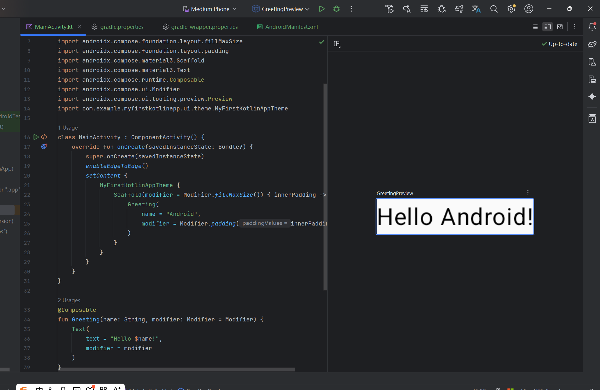
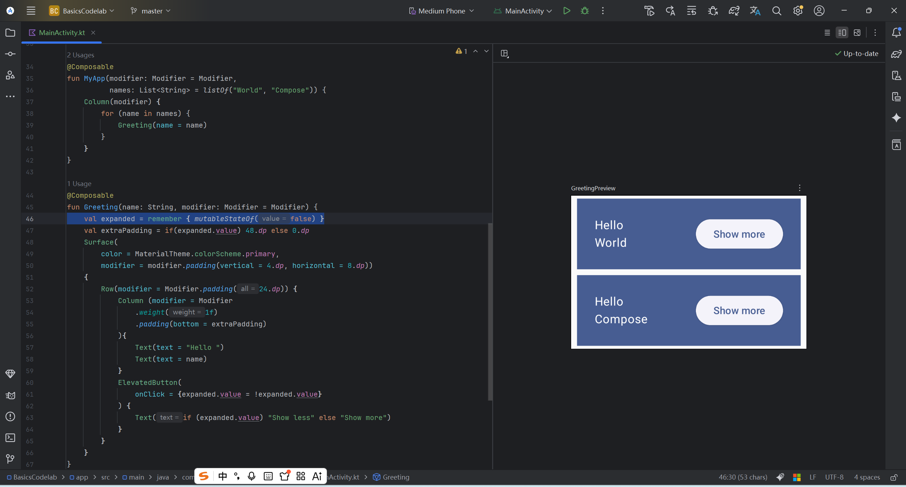
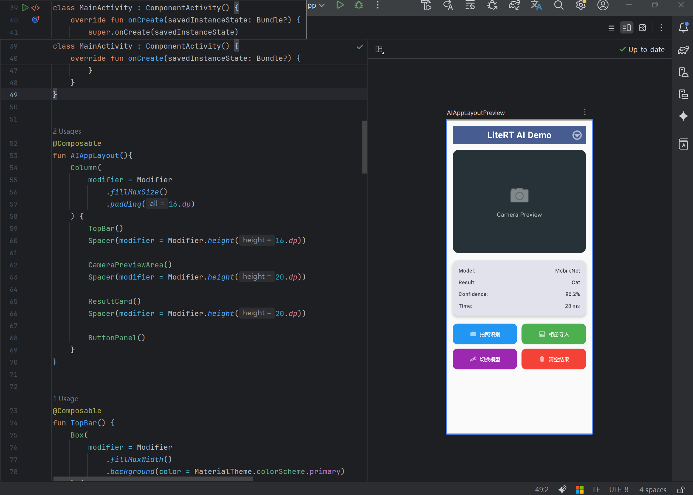

# 实验2_2：构建Kotlin应用并使用Compose布局

## 一、实验目的

- 掌握使用Kotlin语言开发Android的基本流程。
- 掌握AndroidCompose布局的基本用法。
- 进一步熟悉Kotlin语言的特性。

## 二、实验环境

- 开发工具：Android Studio
- 编程语言：Kotlin
- 最低 SDK：API 21 (Android 5.0，Compose 支持的最低版本)
- 操作系统：Windows 

## 三、实验内容与步骤
### 3.1. 安装 创建首个Kotlin应用
实现效果：

### 3.2. 实践Compose布局
主要代码：
```
class MainActivity : ComponentActivity() {
    override fun onCreate(savedInstanceState: Bundle?) {
        super.onCreate(savedInstanceState)
        setContent {
            BasicsCodelabTheme {
                MyApp(modifier = Modifier.fillMaxSize())
            }
        }
    }
}

@Composable
fun MyApp(modifier: Modifier = Modifier,
          names: List<String> = listOf("World", "Compose")) {
    Column(modifier) {
        for (name in names) {
            Greeting(name = name)
        }
    }
}

@Composable
fun Greeting(name: String, modifier: Modifier = Modifier) {
    val expanded = remember { mutableStateOf(false) }
    val extraPadding = if(expanded.value) 48.dp else 0.dp
    Surface(
        color = MaterialTheme.colorScheme.primary,
        modifier = modifier.padding(vertical = 4.dp, horizontal = 8.dp))
    {
        Row(modifier = Modifier.padding(24.dp)) {
            Column (modifier = Modifier
                .weight(1f)
                .padding(bottom = extraPadding)
            ){
                Text(text = "Hello ")
                Text(text = name)
            }
            ElevatedButton(
                onClick = {expanded.value = !expanded.value}
            ) {
                Text(if (expanded.value) "Show less" else "Show more")
            }
        }
    }
}

@Preview(showBackground = true, widthDp = 320)
@Composable
fun GreetingPreview() {
    BasicsCodelabTheme {
        MyApp()
    }
}
```
实现效果：

### 3.3. 完成面向AI应用的Compose布局
主要代码：
```
class MainActivity : ComponentActivity() {
    override fun onCreate(savedInstanceState: Bundle?) {
        super.onCreate(savedInstanceState)
        enableEdgeToEdge()
        setContent {
            MobileNetTheme {
                AIAppLayout()
            }
        }
    }
}


@Composable
fun AIAppLayout(){
    Column(
        modifier = Modifier
            .fillMaxSize()
            .padding(16.dp)
    ) {
        TopBar()
        Spacer(modifier = Modifier.height(16.dp))

        CameraPreviewArea()
        Spacer(modifier = Modifier.height(20.dp))

        ResultCard()
        Spacer(modifier = Modifier.height(20.dp))

        ButtonPanel()
    }
}


@Composable
fun TopBar() {
    Box(
        modifier = Modifier
            .fillMaxWidth()
            .background(color = MaterialTheme.colorScheme.primary)
    ) {
        Text(
            text = "LiteRT AI Demo",
            fontSize = 24.sp,
            fontWeight = FontWeight.Bold,
            color = Color.White,
            modifier = Modifier.align(Alignment.Center)
        )

        IconButton(
            onClick = { /*菜单点击事件*/ },
            modifier = Modifier.align(Alignment.CenterEnd)
        ) {
            Icon(
                painter = painterResource(id = android.R.drawable.ic_menu_more),
                contentDescription = "更多选项",
                tint = Color.White
            )
        }
    }
}
@Composable
fun CameraPreviewArea(){
    Box(
        modifier = Modifier
            .fillMaxWidth()
            .height(280.dp)
            .background(
                color = Color(0xFF263238),
                shape = RoundedCornerShape(16.dp)
            ),
        contentAlignment = Alignment.Center
    ){
        Column (horizontalAlignment = Alignment.CenterHorizontally){
            Icon(
                painter = painterResource(id = android.R.drawable.ic_menu_camera),
                contentDescription = "相机预览",
                modifier = Modifier.size(64.dp),
                tint = Color.White.copy(alpha = 0.7f)
            )
            Spacer(modifier = Modifier.height(8.dp))
            Text(
                text = "Camera Preview",
                color = Color.White.copy(alpha = 0.7f),
                fontSize = 16.sp
            )
        }
    }

}

@Composable
fun ResultCard(){
    Card(
        modifier = Modifier.fillMaxWidth(),
        shape = RoundedCornerShape(16.dp),
        elevation = CardDefaults.cardElevation(defaultElevation = 4.dp),
        colors = CardDefaults.cardColors(
            containerColor = MaterialTheme.colorScheme.surfaceVariant
        )
    ) {
        Column(
            modifier = Modifier
                .fillMaxWidth()
                .padding(16.dp)
        ){
            InfoRow(label = "Model:", value = "MobileNet")
            Spacer(modifier = Modifier.height(8.dp))

            InfoRow(label = "Result:", value = "Cat")
            Spacer(modifier = Modifier.height(8.dp))

            InfoRow(label = "Confidence:", value = "96.2%")
            Spacer(modifier = Modifier.height(8.dp))
            InfoRow(label = "Time:", value = "28 ms")
        }
    }
}

@Composable
fun InfoRow(label: String, value: String, isHighlight: Boolean = false) {
    Row(
        modifier = Modifier.fillMaxWidth(),
        horizontalArrangement = Arrangement.SpaceBetween
    ) {
        Text(
            text = label,
            fontSize = 14.sp,
            color = MaterialTheme.colorScheme.onSurfaceVariant,
            fontWeight = FontWeight.Medium
        )
        Text(
            text = value,
            fontSize = if (isHighlight) 16.sp else 14.sp,
            fontWeight = if (isHighlight) FontWeight.Bold else FontWeight.Normal,
            color = if (isHighlight) Color(0xFF4CAF50) else MaterialTheme.colorScheme.onSurface
        )
    }
}

@Composable
fun ButtonPanel() {
    Column(
        modifier = Modifier.fillMaxWidth(),
        verticalArrangement = Arrangement.spacedBy(12.dp)
    ) {
        Row(
            modifier = Modifier.fillMaxWidth(),
            horizontalArrangement = Arrangement.spacedBy(12.dp)
        ) {
            // 蓝色按钮
            ActionButton(
                text = "拍照识别",
                icon = android.R.drawable.ic_menu_camera,
                modifier = Modifier.weight(1f),
                onClick = { /* 拍照逻辑 */ },
                color = Color(0xFF2196F3)  // 蓝色
            )

            // 绿色按钮
            ActionButton(
                text = "相册导入",
                icon = android.R.drawable.ic_menu_gallery,
                modifier = Modifier.weight(1f),
                onClick = { /* 相册逻辑 */ },
                color = Color(0xFF4CAF50)  // 绿色
            )
        }

        Row(
            modifier = Modifier.fillMaxWidth(),
            horizontalArrangement = Arrangement.spacedBy(12.dp)
        ) {
            // 紫色按钮
            ActionButton(
                text = "切换模型",
                icon = android.R.drawable.ic_menu_manage,
                modifier = Modifier.weight(1f),
                onClick = { /* 切换模型逻辑 */ },
                color = Color(0xFF9C27B0)  // 紫色
            )

            // 红色按钮
            ActionButton(
                text = "清空结果",
                icon = android.R.drawable.ic_menu_delete,
                modifier = Modifier.weight(1f),
                onClick = { /* 清空逻辑 */ },
                color = Color(0xFFF44336)  // 红色
            )
        }
    }
}

// 操作按钮组件（增加 color 参数，默认保持原主题色）
@Composable
fun ActionButton(
    text: String,
    icon: Int,
    modifier: Modifier = Modifier,
    onClick: () -> Unit,
    color: Color = MaterialTheme.colorScheme.primary 
) {
    Button(
        onClick = onClick,
        modifier = modifier.height(56.dp),
        shape = RoundedCornerShape(12.dp),
        colors = ButtonDefaults.buttonColors(
            containerColor = color,            
            contentColor = Color.White
        )
    ) {
        Row(
            horizontalArrangement = Arrangement.Center,
            verticalAlignment = Alignment.CenterVertically
        ) {
            Icon(
                painter = painterResource(id = icon),
                contentDescription = text,
                modifier = Modifier.size(20.dp)
            )
            Spacer(modifier = Modifier.width(8.dp))
            Text(text = text, fontSize = 14.sp)
        }
    }
}

@Preview(showBackground = true)
@Composable
fun AIAppLayoutPreview() {
    MobileNetTheme{
        AIAppLayout()
    }
}
```
实现效果：


## 四、实验总结

通过本次实验，我完成了以下学习目标：

1.  **Kotlin Android 开发流程**：掌握了从新建项目、编写 Compose UI 到运行调试的完整流程。
2.  **Jetpack Compose 布局**：熟悉了声明式 UI 的编程范式，掌握了 `Column`、`Row`、`Box`、`Card` 等常用布局组件的使用。
3.  **状态管理**：理解了 `remember` 和 `mutableStateOf` 在 Compose 中的状态管理机制。
4.  **AI 应用界面设计**：结合 AI 应用场景，设计了结构清晰、功能完整的图像识别界面，为后续集成相机和模型推理打下了基础。

Compose 相比传统 XML 布局，代码更简洁、类型安全、且与 Kotlin 语言特性高度融合，显著提升了 Android UI 开发的效率和可维护性。

## 五、参考资料

-   [Kotlin 官方网站](https://kotlinlang.org/)
-   [Jetpack Compose 教程](https://developer.android.com/jetpack/compose/tutorial)
-   [Jetpack Compose 基础知识](https://developer.android.com/courses/pathways/compose)
-   [Compose 中的基本布局](https://developer.android.com/jetpack/compose/layout)
-   [Compose 状态管理](https://developer.android.com/jetpack/compose/state)

## 六、附件与代码仓库

-   本实验完整代码已上传至 GitHub：  
    [https://github.com/bukuujun/rk3/tree/master/sy2_2](https://github.com/bukuujun/rk3/tree/master/sy2_2)

