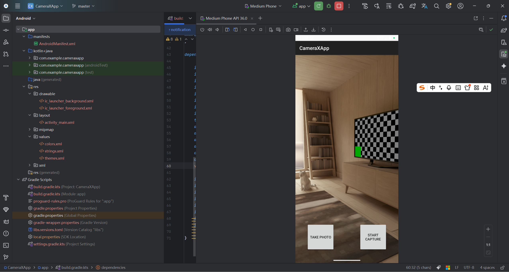
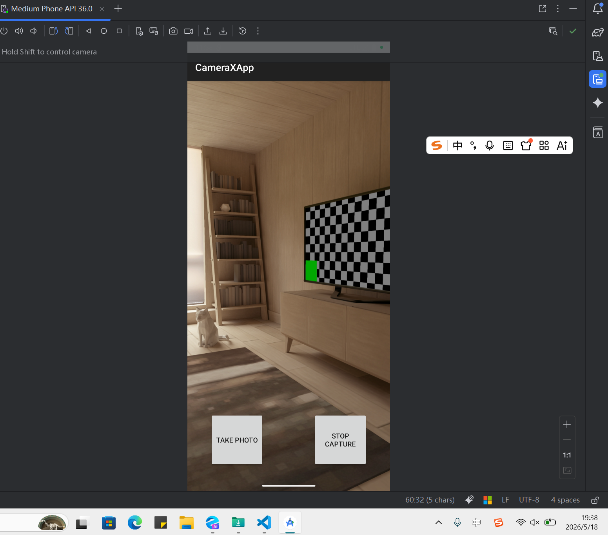

# Android CameraX 

本应用基于 Jetpack CameraX 库实现相机预览、拍照、视频录制以及实时图像分析（可选）功能。项目遵循 Android 官方推荐的最佳实践，最低支持 API 21（Android 5.0）。

## 实验目的

- 掌握 Android CameraX 拍照、视频捕捉的基本用法
- 学习 Android 硬件权限动态申请流程
- 熟悉 Kotlin 语言在 Android 开发中的应用
- 了解 CameraX 的四个核心用例：Preview、ImageCapture、VideoCapture、ImageAnalysis（扩展）

## 功能特性

| 功能 | 描述 |
|------|------|
| 相机预览 | 实时显示摄像头画面 |
| 拍照 | 拍摄高质量静态图片并保存 |
| 视频录制 | 录制视频并保存到本地 |
| 动态权限请求 | 自动处理 `CAMERA` 和 `RECORD_AUDIO` 权限 |

## 项目截图





## 技术栈

- 开发工具：Android Studio Hedgehog 或更高版本
- 语言：Kotlin
- 最低 SDK：API 21
- 核心依赖：CameraX (1.5.0-alpha06)

## 快速开始

### 1. 克隆项目

```bash
git clone https://github.com/bukuujun/rk3.git
cd sy2_3
```

### 2. 打开项目
使用 Android Studio 打开项目文件夹，等待 Gradle 同步完成。

### 3. 运行运用
连接 Android 设备或启动模拟器（API 21+），点击运行按钮。

### 项目配置
### 添加依赖
在 app/build.gradle.kts 或 build.gradle 中添加 CameraX 依赖：
```
val camerax_version = "1.5.0-alpha06"
implementation("androidx.camera:camera-core:${camerax_version}")
implementation("androidx.camera:camera-camera2:${camerax_version}")
implementation("androidx.camera:camera-lifecycle:${camerax_version}")
implementation("androidx.camera:camera-video:${camerax_version}")
implementation("androidx.camera:camera-view:${camerax_version}")
// 可选扩展
implementation("androidx.camera:camera-mlkit-vision:${camerax_version}")
implementation("androidx.camera:camera-extensions:${camerax_version}")
```

### 权限声明
在 AndroidManifest.xml 中添加：
```
<uses-permission android:name="android.permission.CAMERA" />
<uses-permission android:name="android.permission.RECORD_AUDIO" />
<uses-feature android:name="android.hardware.camera" android:required="true" />
```

### 动态权限请求
在 MainActivity.kt 中使用 ActivityResultContracts.RequestPermission() 或 registerForActivityResult 处理运行时权限。

### 核心实现
布局文件 (activity_main.xml)
PreviewView：用于显示相机预览

ImageButton：拍照按钮

ImageButton：录像按钮（开始/停止）

TextView：状态提示

### 主要代码流程
-启动相机：绑定 ProcessCameraProvider，将 Preview 用例与 PreviewView 关联。

-拍照功能：创建 ImageCapture 用例，点击拍照时调用 takePicture() 保存图片到 MediaStore。

-录像功能：创建 VideoCapture 用例，通过 startRecording() 和 stopRecording() 控制。

详细代码见 MainActivity.kt

### 实验总结
通过本实验，我们：

-掌握了 CameraX 的基本使用模式

-理解了不同用例的生命周期绑定方式

-学会了如何处理相机权限和设备兼容性