# 实验3：Jupyter Notebook 基础实践

## 一、实验目的

-   进一步熟悉 Python 语法。
-   掌握 Jupyter Notebook 开发的基本流程。
-   熟悉 Python 中常用库（Pandas、Matplotlib）的用法。

## 二、实验环境

-   开发工具：Anaconda (Jupyter Notebook)
-   编程语言：Python 3.7+
-   依赖库：
    
    -   Jupyter Notebook
    -   Pandas
    -   Matplotlib
-   操作系统：Windows / macOS / Linux 均可

## 三、实验内容与步骤

### 创建一个新的Notebook

新建一个Notebook Python 3 (ipykernel)，生成了一个`Untitled.ipynb`文件。`.ipynb`文件即所谓的一个Notebook，实际是基于JSON格式的文本文件，并且包含元数据(“Edit > Edit Notebook Metadata”)。

这里有两个关键元素cell和kernal

-   cell: 文本或者代码执行单元，由kernel执行。
-   kernel: 计算引擎，执行cell的文本或者代码，本文基于Python 3 ipykernel引擎。

### cell

主要包含两种类型的cell：

-   代码cell：包含可被kernel执行的代码，执行之后在下方显示输出。
-   Markdown cell：书写Markdown标记语言的cell。

试着输入一行代码，查看执行效果：

```python
print('Hello World!')
```
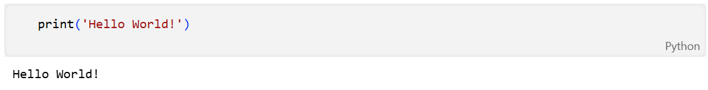

代码执行之后，cell左侧的标签从`In [ ]` 变成了 `In [1]`。`In`代表输入，`[]`中的数字代kernel执行的顺序，而`In [*]`则表示代码cell正在执行代码。以下例子显示了短暂的`In [*]`程。

```python
import time
time.sleep(3)
```

#### cell模式

有两种模式，编辑模式（edit mode）和命名模式（command mode）

-   编辑模式：enter健切换，绿色轮廓
-   命令模式：esc健切换，蓝色轮廓

#### 快捷键

使用`Ctrl + Shift + P`命令可以查看所有Notebook支持的命令。

在命名模式下，一些快捷键将十分有帮助

-   上下键头可以上下cell移动
-   A 或者 B在上方或者下方插入一个cell
-   M 将转换活动cell为Markdown cell
-   Y 将设置活动cell为代码 cell
-   D+D（两次）删除cell
-   Z 撤销删除
-   H 打开所有快捷键的说明

在编辑模式，`Ctrl + Shift + -`将以光标处作为分割点，将cell一分为二。

### Kernel

每个notebook都基于一个内核运行，当执行cell代码时，代码将在内核当中运行，运行的结果会显示在页面上。Kernel中运行的状态在整个文档中是延续的，可以跨越所有的cell。这意思着在一个Notebook某个cell定义的函数或者变量等，在其他cell也可以使用。例如：

```python
import numpy as np
def square(x):
    return x * x
```

执行上述代码cell之后，后续cell可以使用`np`和`square`

```python
x = np.random.randint(1, 10)
y = square(x)
print('%d squared is %d' % (x, y))
```

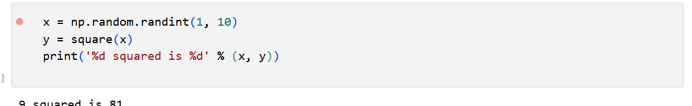

注意：Restart Kernal将清空保存在内存中的变量。同时，在浏览器中关闭一个正在运行的notebook页面，并未真正关闭终止Kernel的运行，其还是后台执行。要真正关闭，可选择`File > Close and Halt`，或者`Kernel > Shutdown`。

以下教程将分两个例子实现基本的Notebook编写，包括简单的Python程序和Python数据分析的例子。首先，重命名文档，更改`Untitled`并输入相关文件名。注意，在写作过程中，常用`Ctrl + S`保存已有的文档。

## 简单的Python程序的例子

本节主要目的掌握[python的基本语法](https://www.runoob.com/python/python-basic-syntax.html)，要求完成基于python的选择排序算法：

1.  定义selection\_sort函数执行选择排序功能。
2.  定义test函数进行测试，执行数据输入，并调用selection\_sort函数进行排序，最后输出结果。

## 数据分析的例子

本例中将分析历年财富世界500强的数据(1955-2005)，可从[此处下载](https://www.jianguoyun.com/p/DabvAJEQ7JmuCRjI1LwEIAA)。

### 设置

导入相关的工具库

```python
%matplotlib inline
import pandas as pd
import matplotlib.pyplot as plt
import seaborn as sns
```

[pandas](https://pandas.pydata.org/docs/)用于数据处理，matplotlib用于绘图，seaborn使绘图更美观。第一行不是python命令，而被称为line magic。%表示作用于一行，%%表示作用于全文。此处%matplotlib inline 表示使用matlib画图，并将图片输出。

随后，加载数据集。

```python
df = pd.read_csv('fortune500.csv')
```

### 检查数据集

上述代码执行生成的df对象，是 pandas 常用的数据结构，称为`DataFrame`，可以理解为数据表。

```python
df.head()
```

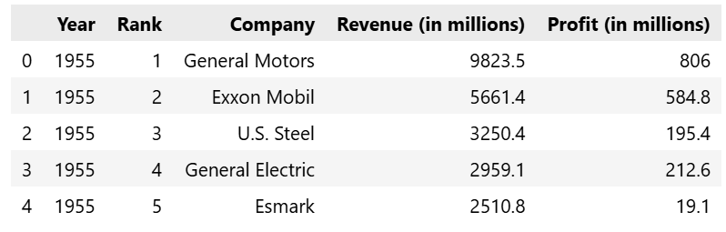

```python
df.tail()
```
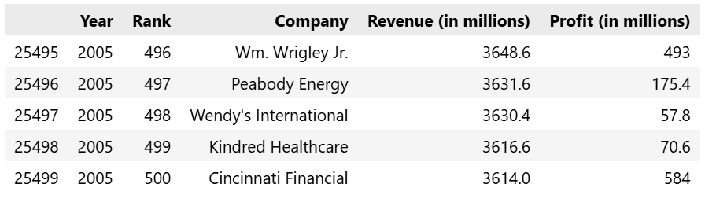

对数据属性列进行重命名，以便在后续访问

```python
df.columns = ['year', 'rank', 'company', 'revenue', 'profit']
```

接下来，检查数据条目是否加载完整。

```python
len(df)
```

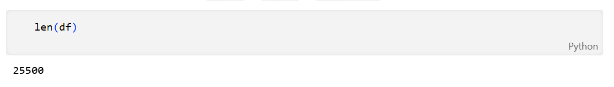

从1955至2055年总共有25500条目录。然后，检查属性列的类型。

```python
df.dtypes
```

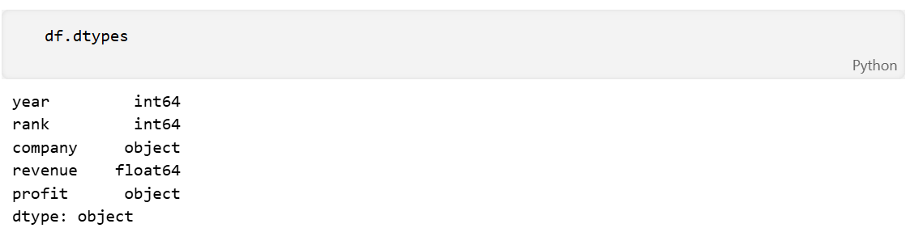

其他属性列都正常，但是对于profit属性，期望的结果是float类型，因此其可能包含非数字的值，利用正则表达式进行检查。

```python
non_numberic_profits = df.profit.str.contains('[^0-9.-]')
df.loc[non_numberic_profits].head()
```

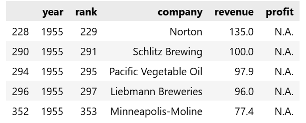

确实存在这样的记录，profit这一列为字符串，统计一下到底存在多少条这样的记录。

```python
len(df.profit[non_numberic_profits])
```

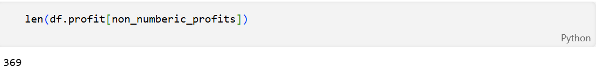

总体来说，利润（profit）列包含非数字的记录相对来说较少。更进一步，使用直方图显示一下按照年份的分布情况。

```python
bin_sizes, _, _ = plt.hist(df.year[non_numberic_profits], bins=range(1955, 2006))
```

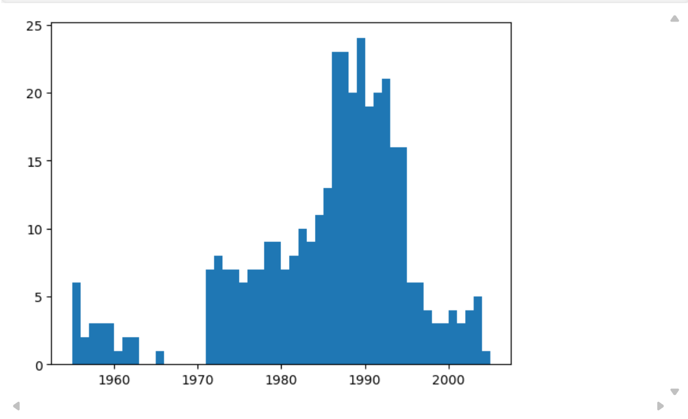

可见，单独年份这样的记录数都少于25条，即少于4%的比例。这在可以接受的范围内，因此删除这些记录。

```python
df = df.loc[~non_numberic_profits]
df.profit = df.profit.apply(pd.to_numeric)
```

再次检查数据记录的条目数。

```python
len(df)
```

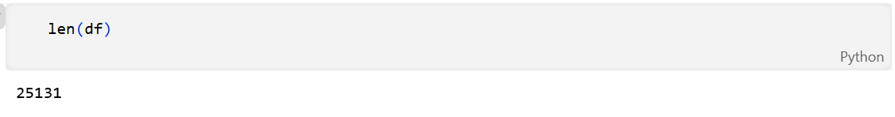

```python
df.dtypes
```

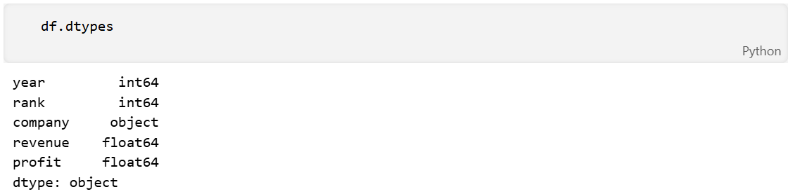

可见，上述操作已经达到清洗无效数据记录的效果。

### 使用matplotlib进行绘图

接下来，以年分组绘制平均利润和收入。首先定义变量和方法。

```python
group_by_year = df.loc[:, ['year', 'revenue', 'profit']].groupby('year')
avgs = group_by_year.mean()
x = avgs.index
y1 = avgs.profit
def plot(x, y, ax, title, y_label):
    ax.set_title(title)
    ax.set_ylabel(y_label)
    ax.plot(x, y)
    ax.margins(x=0, y=0)
```

现在开始绘图

```python
fig, ax = plt.subplots()
plot(x, y1, ax, 'Increase in mean Fortune 500 company profits from 1955 to 2005', 'Profit (millions)')
```

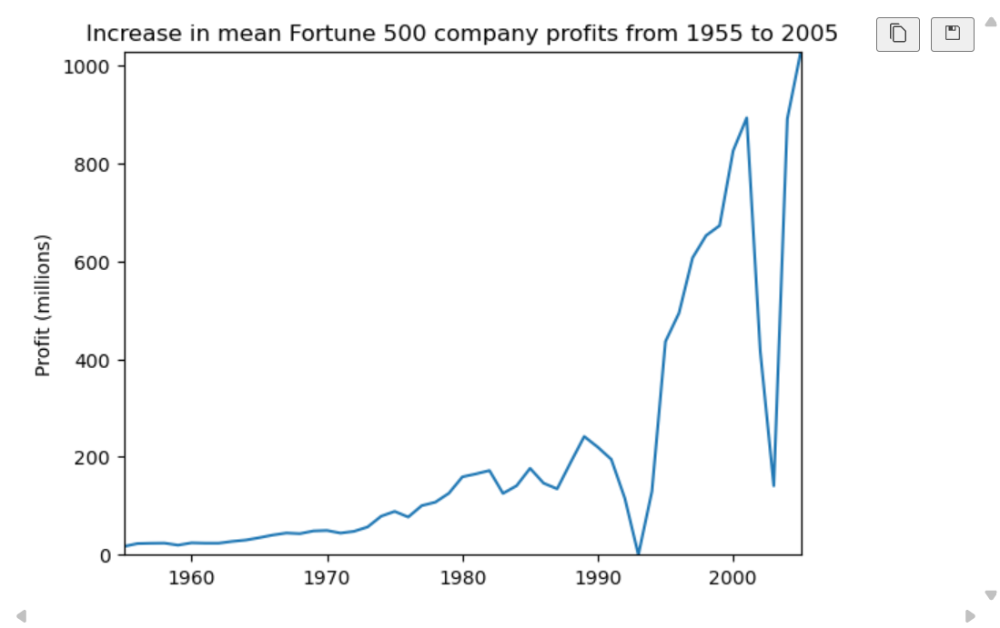

看起来像指数增长，但是1990年代初期出现急剧的下滑，对应当时经济衰退和网络泡沫。再来看看收入曲线。

```python
y2 = avgs.revenue
fig, ax = plt.subplots()
plot(x, y2, ax, 'Increase in mean Fortune 500 company revenues from 1955 to 2005', 'Revenue (millions)')
```

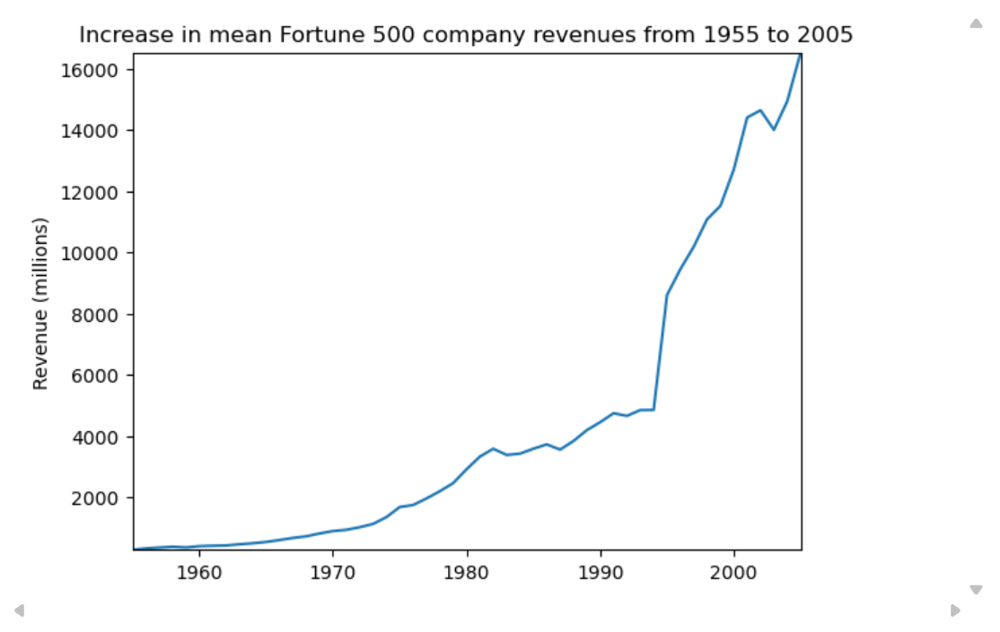

公司收入曲线并没有出现急剧下降，可能是由于财务会计的处理。对数据结果进行标准差处理。

```python
def plot_with_std(x, y, stds, ax, title, y_label):
    ax.fill_between(x, y - stds, y + stds, alpha=0.2)
    plot(x, y, ax, title, y_label)
fig, (ax1, ax2) = plt.subplots(ncols=2)
title = 'Increase in mean and std Fortune 500 company %s from 1955 to 2005'
stds1 = group_by_year.std().profit.values
stds2 = group_by_year.std().revenue.values
plot_with_std(x, y1.values, stds1, ax1, title % 'profits', 'Profit (millions)')
plot_with_std(x, y2.values, stds2, ax2, title % 'revenues', 'Revenue (millions)')
fig.set_size_inches(14, 4)
fig.tight_layout()
```

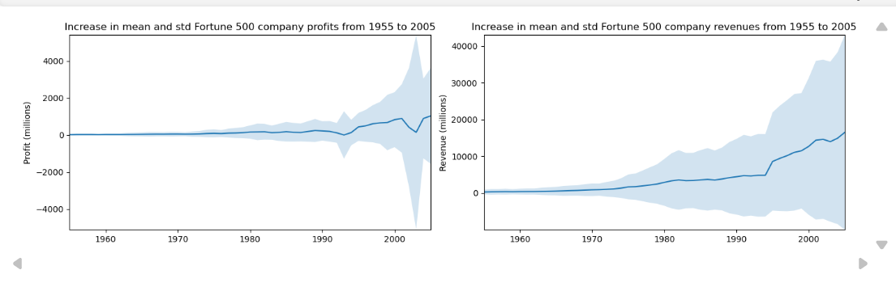

可见，不同公司之间的收入和利润差距惊人，那么到底前10%和后10%的公司谁的波动更大了？此外，还有很多有价值的信息值得进一步挖掘。

## 四、实验总结

通过本次实验，我掌握了以下内容：

1.  **Jupyter Notebook 开发流程**：
    
    -   能够熟练使用快捷键、区分编辑/命令模式，并理解内核的作用。
2.  **Python 语法**：
    
    -   独立实现了选择排序算法，并编写测试函数验证正确性。
3.  **Pandas 数据分析**：
    
    -   掌握了数据加载、缺失值（异常值）处理、列属性检查、条件过滤等常用操作。
4.  **Matplotlib 数据可视化**：
    
    -   能够在一张图中绘制两条折线，并添加图例、标签和网格，使结果清晰可读。
5.  **版本管理与共享**：
    
    -   学会了将 Jupyter Notebook 项目上传至 GitHub 并编写规范的 README。

本次实验为我后续使用 Python 进行更复杂的数据科学任务（如机器学习、深度学习数据预处理）打下了坚实的基础。

## 五、参考资料

-   [Jupyter Notebook 官方文档](https://jupyter.org/)
-   [Pandas 用户指南](https://pandas.pydata.org/docs/user_guide/index.html)
-   [Matplotlib 教程](https://matplotlib.org/stable/tutorials/index.html)
-   [选择排序算法详解](https://en.wikipedia.org/wiki/Selection_sort)

## 六、附件与代码仓库

-   本实验完整 Notebook 及数据文件已上传至 GitHub：  
    [https://github.com/bukuujun/rk3/tree/master/sy3](https://github.com/bukuujun/rk3/tree/master/sy3)