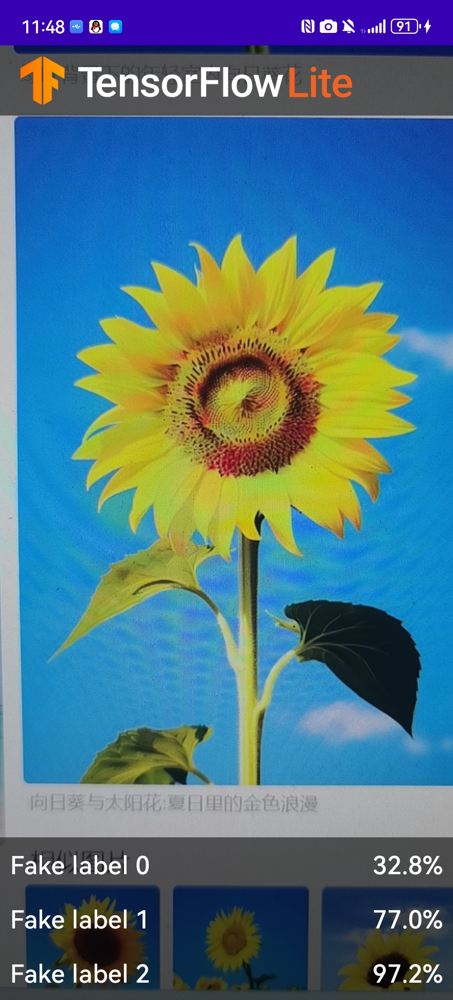
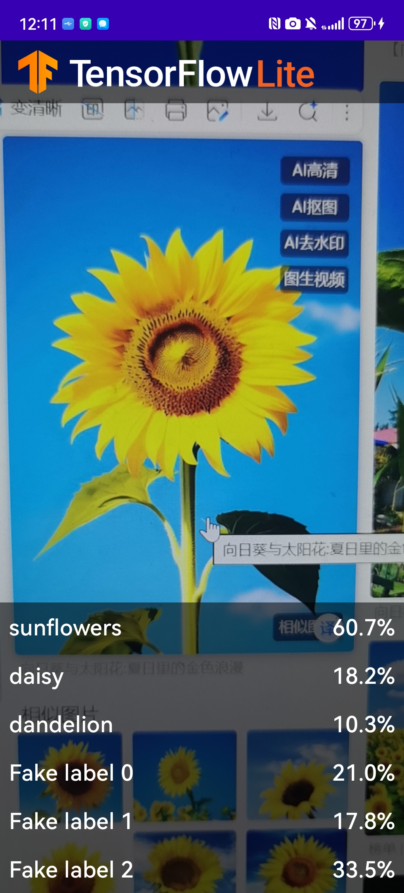

# 实验4：TFLClassify：智能图像分类 APP

本项目是一个基于 **CameraX** + **TensorFlow Lite** 的 Android 图像分类应用，实现了实时相机预览与花卉识别功能。通过本实验，你将理解移动端视觉 AI 应用的完整流水线，掌握 MVVM 架构、数据绑定、模型部署等关键技能。

## 一、实验目标

- 理解 Android 端图像分类应用的基本流水线（摄像头帧 → 预处理 → 推理 → 状态更新 → UI 刷新）
- 区分 CameraX 中 `Preview` 与 `ImageAnalysis` 的职责
- 掌握 `ViewModel`、`LiveData`、`RecyclerView` 与 `DataBinding` 的配合使用
- 学会集成 `.tflite` 模型并进行硬件加速（GPU Delegate）

## 二、项目来源与版本

- GitHub 仓库：[https://github.com/hoitab/TFLClassify.git](https://github.com/hoitab/TFLClassify.git)
- 实验起点：`start` 模块  
- 参考实现：`finish` 模块（运行后理解效果，再回到 `start` 补全 TODO）

## 三、环境要求

- Android Studio (最新稳定版)
- 真机或模拟器（建议真机，需要摄像头权限）
- 最低 SDK 版本：项目配置中指定（通常 API 21+）

## 四、项目结构概览
TFLClassify/
├── start/ # 实验起点代码（需要补全 TODO）
│ ├── src/main/java/.../MainActivity.kt
│ ├── src/main/java/.../ImageAnalyzer.kt
│ ├── src/main/ml/ # 存放 .tflite 模型文件
│ └── res/layout/ # UI 布局文件
├── finish/ # 完整可运行参考代码
└── README.md

## 三、实验内容与步骤

## 下载初始代码

创建工作目录，使用

```powershell
git clone https://github.com/hoitab/TFLClassify.git
```

拷贝代码；或者直接访问github链接下载代码的ZIP包，并解压缩到工作目录。

## 运行初始代码

1.  打开Android Studio，选择“Open an Existing Project”  
2.  选择TFLClassify/build.gradle生成整个项目。项目包含两个module：finish 和 start，finish模块是已经完成的项目，start则是本项目实践的模块。
3.  第一次编译项目时，弹出“Gradle Sync”，将下载相应的gradle wrapper 。  
4.  手机通过USB接口连接开发平台，并设置手机开发者选项允许调试。
5.  选择真实物理机（而不是模拟器）运行start模块  
6.  允许应用获取手机摄像头的权限，得到下述效果图，界面利用随机数表示虚拟的识别结果。  
    
## 向应用中添加TensorFlow Lite

1.  选择"start"模块  
2.  右键“start”模块，或者选择File，然后New>Other>TensorFlow Lite Model  
3.  选择已经下载的自定义的训练模型。本教程模型训练任务以后完成，这里选择finish模块中ml文件下的FlowerModel.tflite。   
    点击“Finish”完成模型导入，系统将自动下载模型的依赖包并将依赖项添加至模块的build.gradle文件。
4.  最终TensorFlow Lite模型被成功导入，并生成摘要信息  
## 检查代码中的TODO项

本项目初始代码中包括了若干的TODO项，以导航项目中未完成之处。为了方便起见，首先查看TODO列表视图，View>Tool Windows>TODO  
默认情况下了列出项目所有的TODO项，进一步按照模块分组（Group By）![在这里插入图片描述]

## 添加代码重新运行 APP

1.  定位“start”模块**MainActivity.kt**文件的TODO 1，添加初始化训练模型的代码

```kotlin
private class ImageAnalyzer(ctx: Context, private val listener: RecognitionListener) :
        ImageAnalysis.Analyzer {

  ...
  // TODO 1: Add class variable TensorFlow Lite Model
  private val flowerModel = FlowerModel.newInstance(ctx)

  ...
}
```

2.  在CameraX的analyze方法内部，需要将摄像头的输入`ImageProxy`转化为`Bitmap`对象，并进一步转化为`TensorImage` 对象

```kotlin
override fun analyze(imageProxy: ImageProxy) {
  ...
  // TODO 2: Convert Image to Bitmap then to TensorImage
  val tfImage = TensorImage.fromBitmap(toBitmap(imageProxy))
  ...
}
```

3.  对图像进行处理并生成结果，主要包含下述操作：

-   按照属性`score`对识别结果按照概率从高到低排序
-   列出最高k种可能的结果，k的结果由常量`MAX_RESULT_DISPLAY`定义

```kotlin
override fun analyze(imageProxy: ImageProxy) {
  ...
  // TODO 3: Process the image using the trained model, sort and pick out the top results
  val outputs = flowerModel.process(tfImage)
      .probabilityAsCategoryList.apply {
          sortByDescending { it.score } // Sort with highest confidence first
      }.take(MAX_RESULT_DISPLAY) // take the top results

  ...
}
```

4.  将识别的结果加入数据对象`Recognition` 中，包含`label`和`score`两个元素。后续将用于`RecyclerView`的数据显示

```kotlin
override fun analyze(imageProxy: ImageProxy) {
  ...
  // TODO 4: Converting the top probability items into a list of recognitions
  for (output in outputs) {
      items.add(Recognition(output.label, output.score))
  }
  ...
}
```

5.  将原先用于虚拟显示识别结果的代码注释掉或者删除

```kotlin
// START - Placeholder code at the start of the codelab. Comment this block of code out.
for (i in 0..MAX_RESULT_DISPLAY-1){
    items.add(Recognition("Fake label $i", Random.nextFloat()))
}
// END - Placeholder code at the start of the codelab. Comment this block of code out.
```

6.  以物理设备重新运行start模块
7.  最终运行效果  
    


### 关键知识点解析
1. CameraX 流水线
Preview：仅负责画面显示，不参与推理。

ImageAnalysis：每一帧都会回调 analyze() 方法，执行模型推理。

生命周期绑定：通过 ProcessCameraProvider.bindToLifecycle() 自动释放相机资源。

2. 数据流与 UI 更新
ViewModel 持有 LiveData<List<Recognition>>

ImageAnalyzer 分析完一帧后更新 ViewModel 中的 LiveData

MainActivity 观察 LiveData，并通过 RecognitionAdapter.submitList() 刷新 RecyclerView

3. 性能优化要点
在 analyze() 末尾务必调用 imageProxy.close()，否则 CameraX 无法继续送帧。

减少列表闪烁：在 RecyclerView 上关闭 itemAnimator。

硬件加速：优先尝试 GPU Delegate，不支持的设备回退到多线程 CPU。

4. ML Model Binding
启用 mlModelBinding true 后，.tflite 文件会自动生成对应的访问类（如 FlowerModel），无需手动编写 Interpreter。

## 四、实验总结

通过本次实验，我掌握了以下内容：

1.  **TensorFlow Lite 集成**  
    学会了如何在 Android 项目中导入 `.tflite` 模型文件，并使用 `Interpreter` 或 ML Model Binding 进行推理。
2.  **CameraX 的使用**  
    理解了 `Preview`、`ImageAnalysis` 等核心用例的配置方法，以及如何处理相机帧数据。
3.  **架构组件**  
    熟悉了 `ViewModel` 管理 UI 状态和 `LiveData` 观察数据变化的模式，提高了代码的可维护性。
4.  **Kotlin 协程与函数式编程**  
    在异步推理和图像处理中使用了协程，提升了应用的响应性能。
5.  **完整开发流程**  
    从获取代码、配置环境、补充 TODO、调试验证到上传 GitHub 并撰写文档，体验了移动端 AI 应用的全流程开发。

本次实验为后续集成更复杂的深度学习模型（如目标检测、图像分割）打下了坚实的基础。


## 五、参考资料

-   [TensorFlow Lite 官方文档](https://www.tensorflow.org/lite)
-   [CameraX 入门指南](https://developer.android.com/training/camerax)
-   [Android 机器学习 (ML) 绑定](https://developer.android.com/studio/write/ml-kit)
-   [项目原始代码仓库](https://github.com/hoitab/TFLClassify)

## 六、附件与代码仓库

本实验完成的代码已上传至 GitHub：  
[https://github.com/bukuujun/rk3/tree/master/sy4](https://github.com/bukuujun/rk3/tree/master/sy4)