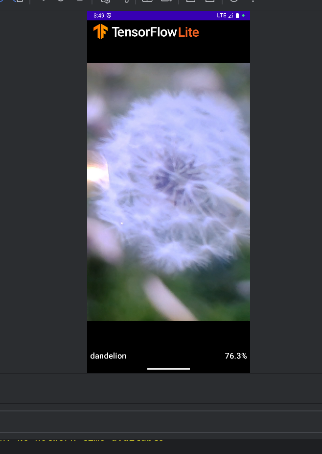

# 实验5：TensorFlow 模型训练与 LiteRT 模型转换

## 一、实验目的

-   了解机器学习的基本概念和工作流程。
-   掌握 TensorFlow 框架的基础用法，理解 Tensor（张量）和 Flow（流）的核心思想。
-   学习使用 TensorFlow/Keras 构建图像分类模型，并完成训练与评估。
-   掌握将训练好的 TensorFlow 模型转换为 LiteRT 格式的方法。
-   使用实验四的 Android 应用验证转换后的模型效果。
-   将完整的训练代码（Jupyter Notebook）上传至 GitHub 并撰写详细文档。

## 二、实验环境

### 2.1 软件环境

-   **操作系统**：Windows / macOS / Linux（推荐使用 Ubuntu 或 Colab）
-   **开发工具**：Jupyter Notebook / Google Colab
-   **Python 版本**：3.8 ~ 3.10（注意与 TensorFlow 版本兼容）
-   **深度学习框架**：TensorFlow 2.x

### 2.2 依赖库

```bash

pip install tensorflow\==2.13.0
pip install numpy matplotlib pillow
```

### 2.3 实验数据

-   **数据集**：花卉数据集（包含雏菊、向日葵、玫瑰、郁金香、蒲公英等类别）
-   可使用 TensorFlow 自带的花卉数据集或自定义数据集

## 三、实验内容与步骤

### 1\. 安装依赖
如果当前 Jupyter kernel 里还没有安装 TensorFlow，请先行安装。可以使用Anaconda创建一个新的环境进行安装。  

建议使用 Python 3.10 或 3.11或更高版本。这个版本只需要 TensorFlow，不需要安装 `tflite-model-maker`。

```python
# 可选：如果当前 notebook 环境还没有安装依赖，取消下一行开头的 # 后运行。
# %pip install -r requirements-modern.txt
```

### requirements-modern.txt的内容

tensorflow>=2.15  
matplotlib>=3.7  
numpy>=1.23

### 2\. 导入库并设置参数

这里会导入训练、数据读取、模型转换需要的库。`FLOWER_URL` 是 TensorFlow 官方示例花卉数据集的下载地址。

如果你不指定自己的图片目录，程序会自动下载这个数据集，并缓存到用户目录下的 Keras 数据集缓存位置，例如 Windows 上通常是 `C:\Users\你的用户名\.keras\datasets\`。

```python
import tarfile
from pathlib import Path

import numpy as np
import tensorflow as tf

# TensorFlow 官方花卉数据集。第一次运行时会自动下载，之后会复用本地缓存。
FLOWER_URL = "https://storage.googleapis.com/download.tensorflow.org/example_images/flower_photos.tgz"

print("TensorFlow 版本:", tf.__version__)
```

```python
# 数据目录配置：
# - DATA_DIR = None：自动下载并使用 TensorFlow 官方 flowers 数据集。
# - DATA_DIR = r"D:\path\to\my_images"：使用你自己的图片分类目录。
#
# 自定义图片目录需要按类别分文件夹，例如：
# my_images/
#   daisy/
#     1.jpg
#   roses/
#     2.jpg
DATA_DIR = None

# 导出目录。训练完成后会在这里生成 model.tflite、labels.txt 和 flower_classifier.keras。
EXPORT_DIR = "exported_flower_model"

# 训练参数。教程演示可以先用 3 到 5 个 epoch；如果使用自己的数据，可以适当增加。
EPOCHS = 5
BATCH_SIZE = 32
IMAGE_SIZE = 224
LEARNING_RATE = 1e-3

# TFLite 量化方式：
# - "dynamic"：默认推荐，模型更小，通常最容易成功。
# - "float16"：适合部分支持 float16 的设备。
# - "int8"：体积更小，但需要代表性数据集，转换要求更严格。
# - "none"：不量化，保留浮点模型。
QUANTIZATION = "dynamic"

# 固定随机种子，方便训练/验证划分尽量可复现。
SEED = 123
```

### 3\. 读取并划分数据集

`load_flower_datasets` 完成三件事：

1.  如果 `DATA_DIR` 是 `None`，自动下载并解压官方花卉数据集。
2.  使用 `image_dataset_from_directory` 按文件夹名生成分类标签。
3.  将数据划分为训练集、验证集和测试集，并开启缓存、打乱与预取，加快训练过程。

```python
def load_flower_datasets(data_dir, image_size, batch_size, seed):
    # 如果没有传入自定义数据目录，就下载 TensorFlow 官方 flower_photos 数据集。
    if data_dir is None:
        archive_path = tf.keras.utils.get_file(
            "flower_photos.tgz",
            FLOWER_URL,
            extract=False,
        )
        archive_path = Path(archive_path)

        # Keras 可能已经缓存了解压后的目录；先检查常见位置，避免重复解压。
        candidates = [
            archive_path.parent / "flower_photos",
            archive_path.parent / "flower_photos_extracted" / "flower_photos",
        ]
        data_dir = next((path for path in candidates if path.exists()), None)
        if data_dir is None:
            with tarfile.open(archive_path, "r:gz") as tar:
                tar.extractall(archive_path.parent / "flower_photos_extracted")
            data_dir = archive_path.parent / "flower_photos_extracted" / "flower_photos"
    else:
        data_dir = Path(data_dir)

    # 从目录读取图片。目录下的每个子文件夹会被当作一个类别。
    train_ds = tf.keras.utils.image_dataset_from_directory(
        data_dir,
        validation_split=0.2,
        subset="training",
        seed=seed,
        image_size=(image_size, image_size),
        batch_size=batch_size,
    )
    val_ds = tf.keras.utils.image_dataset_from_directory(
        data_dir,
        validation_split=0.2,
        subset="validation",
        seed=seed,
        image_size=(image_size, image_size),
        batch_size=batch_size,
    )
    class_names = train_ds.class_names

    # 原始 validation 部分再拆成验证集和测试集：验证集用于训练过程中观察效果，测试集用于最后评估。
    val_batches = int(tf.data.experimental.cardinality(val_ds).numpy())
    test_ds = val_ds.take(val_batches // 2)
    val_ds = val_ds.skip(val_batches // 2)

    # cache/prefetch 可以减少数据读取等待；shuffle 只用于训练集。
    autotune = tf.data.AUTOTUNE
    train_ds = train_ds.cache().shuffle(1000, seed=seed).prefetch(autotune)
    val_ds = val_ds.cache().prefetch(autotune)
    test_ds = test_ds.cache().prefetch(autotune)
    return train_ds, val_ds, test_ds, class_names
```

```python
# 加载数据集并查看类别名称。
train_ds, val_ds, test_ds, class_names = load_flower_datasets(
    DATA_DIR,
    IMAGE_SIZE,
    BATCH_SIZE,
    SEED,
)

print("类别数量:", len(class_names))
print("类别名称:", class_names)
```

### 4\. 构建并训练 Keras 模型

这里使用迁移学习：底座模型是 ImageNet 预训练的 `MobileNetV2`，它已经学过很多通用图像特征。我们冻结底座模型，只训练最后新增的分类层。

这样做的好处是训练速度快、需要的数据量少，也更适合后续转换为移动端可用的 TFLite 模型。

```python
def build_model(num_classes, image_size, learning_rate):
    # 输入图片尺寸固定为 IMAGE_SIZE x IMAGE_SIZE x 3。
    inputs = tf.keras.Input(shape=(image_size, image_size, 3), name="image")

    # MobileNetV2 有自己的预处理方式，这里把像素值转换到模型期望的范围。
    x = tf.keras.applications.mobilenet_v2.preprocess_input(inputs)

    # include_top=False 表示不要 ImageNet 原始的 1000 类分类头，只保留特征提取部分。
    base_model = tf.keras.applications.MobileNetV2(
        input_shape=(image_size, image_size, 3),
        include_top=False,
        weights="imagenet",
        pooling="avg",
    )

    # 冻结预训练模型参数，只训练后面的 Dense 分类层。
    base_model.trainable = False
    x = base_model(x, training=False)
    x = tf.keras.layers.Dropout(0.2)(x)

    # 输出维度等于类别数量，softmax 输出每个类别的概率。
    outputs = tf.keras.layers.Dense(num_classes, activation="softmax", name="predictions")(x)
    model = tf.keras.Model(inputs, outputs)

    model.compile(
        optimizer=tf.keras.optimizers.Adam(learning_rate=learning_rate),
        loss=tf.keras.losses.SparseCategoricalCrossentropy(),
        metrics=["accuracy"],
    )
    return model
```

```python
# 创建模型并打印结构。第一次运行会下载 MobileNetV2 的 ImageNet 预训练权重。
model = build_model(len(class_names), IMAGE_SIZE, LEARNING_RATE)
model.summary()
```

```python
# 开始训练。history 中会保存每个 epoch 的 loss、accuracy、val_loss、val_accuracy。
history = model.fit(train_ds, validation_data=val_ds, epochs=EPOCHS)
```

```python
# 使用测试集评估模型。测试集没有参与训练，用于更客观地观察最终效果。
loss, accuracy = model.evaluate(test_ds)
print(f"test_loss={loss:.4f}, test_accuracy={accuracy:.4f}")
```

### 5\. 转换为 TensorFlow Lite 模型

训练完成后，先把 Keras 模型保存为 `.keras` 文件，再使用 `tf.lite.TFLiteConverter.from_keras_model(model)` 转换为 `.tflite`。

本 notebook 默认使用动态范围量化 `dynamic`，通常可以减小模型体积，并且不需要额外准备复杂的校准数据。

```python
def convert_to_tflite(model, quantization, representative_ds):
    # 从 Keras 模型创建 TFLite 转换器。
    converter = tf.lite.TFLiteConverter.from_keras_model(model)

    if quantization == "dynamic":
        # 动态范围量化：最常用、最容易成功的压缩方式。
        converter.optimizations = [tf.lite.Optimize.DEFAULT]
    elif quantization == "float16":
        # float16 量化：权重使用半精度浮点数，适合部分移动端/GPU 场景。
        converter.optimizations = [tf.lite.Optimize.DEFAULT]
        converter.target_spec.supported_types = [tf.float16]
    elif quantization == "int8":
        # int8 全整数量化：体积更小，但需要代表性数据集校准输入分布。
        converter.optimizations = [tf.lite.Optimize.DEFAULT]

        def representative_data_gen():
            for images, _ in representative_ds.take(100):
                for image in images:
                    yield [tf.expand_dims(tf.cast(image, tf.float32), 0)]

        converter.representative_dataset = representative_data_gen
        converter.target_spec.supported_ops = [tf.lite.OpsSet.TFLITE_BUILTINS_INT8]
        converter.inference_input_type = tf.uint8
        converter.inference_output_type = tf.uint8
    elif quantization != "none":
        raise ValueError(f"Unsupported quantization mode: {quantization}")

    return converter.convert()
```

```python
# 创建导出目录。
export_dir = Path(EXPORT_DIR)
export_dir.mkdir(parents=True, exist_ok=True)

# 保存标签文件。部署时需要 labels.txt 把模型输出编号映射回类别名称。
labels_path = export_dir / "labels.txt"
labels_path.write_text("\n".join(class_names) + "\n", encoding="utf-8")

# 保存 Keras 原始模型，便于以后继续训练或重新转换。
keras_path = export_dir / "flower_classifier.keras"
model.save(keras_path)

# 转换并保存 TFLite 模型。
tflite_model = convert_to_tflite(model, QUANTIZATION, train_ds)
tflite_path = export_dir / "model.tflite"
tflite_path.write_bytes(tflite_model)

print(f"已保存 Keras 模型: {keras_path}")
print(f"已保存 TFLite 模型: {tflite_path}")
print(f"已保存标签文件: {labels_path}")
```

### 6\. 简单测试导出的 TFLite 模型

最后用 `tf.lite.Interpreter` 加载刚导出的 `.tflite` 文件，取几张测试图片做推理，确认模型文件可以正常运行。

这里的 smoke test 不是完整评估，只是快速检查：模型能否加载、输入输出张量是否正常、预测流程是否能跑通。

```python
def smoke_test_tflite(tflite_path, test_ds, class_names):
    # 加载 TFLite 模型并分配张量内存。
    interpreter = tf.lite.Interpreter(model_path=str(tflite_path))
    interpreter.allocate_tensors()
    input_details = interpreter.get_input_details()[0]
    output_details = interpreter.get_output_details()[0]

    # 从测试集中取 8 张图片做快速推理。
    images, labels = next(iter(test_ds.unbatch().batch(8)))
    input_data = tf.cast(images, input_details["dtype"]).numpy()

    # 如果模型是 uint8 输入，需要按照量化参数把图片转换到对应范围。
    if input_details["dtype"] == np.uint8:
        scale, zero_point = input_details["quantization"]
        if scale:
            input_data = images.numpy() / scale + zero_point
            input_data = np.clip(input_data, 0, 255).astype(np.uint8)

    predictions = []
    for image in input_data:
        interpreter.set_tensor(input_details["index"], np.expand_dims(image, 0))
        interpreter.invoke()
        predictions.append(interpreter.get_tensor(output_details["index"])[0])

    predicted_ids = np.argmax(np.asarray(predictions), axis=1)
    for expected, predicted in zip(labels.numpy()[:5], predicted_ids[:5]):
        print(f"真实类别={class_names[expected]}, 预测类别={class_names[predicted]}")
```

```python
# 运行 TFLite 快速测试。
smoke_test_tflite(tflite_path, test_ds, class_names)
```

将实验4中的模型替换成训练后的模型并运行



## 四、实验总结

通过本次实验，我掌握了以下内容：

1.  **机器学习基础**  
    理解了机器学习的基本流程（数据准备 → 模型构建 → 训练 → 评估 → 部署）。
2.  **TensorFlow 框架**  
    学会了 Tensor 和 Flow 的核心概念，掌握使用 Keras API 快速构建图像分类模型。
3.  **迁移学习应用**  
    使用 MobileNetV2 预训练模型显著减少了训练时间和数据量要求。
4.  **模型转换**  
    掌握了 TensorFlow Lite Converter 的使用，将标准模型转换为适用于移动端的 LiteRT 格式，并应用量化技术优化模型大小。
5.  **端到端验证**  
    将训练的模型集成到 Android 应用中，验证了模型在实际移动设备上的效果。
6.  **版本管理**  
    将完整的 Jupyter Notebook 训练代码上传至 GitHub，并撰写了规范的 README 文档。

TensorFlow 模型训练与 LiteRT 转换是移动端 AI 应用开发的核心技能，本次实验为后续开发更复杂的计算机视觉应用（如目标检测、语义分割）打下了坚实基础。

## 五、参考资料

-   [TensorFlow 官方文档](https://www.tensorflow.org/)
-   [TensorFlow Lite 文档](https://www.tensorflow.org/lite)
-   [Keras API 参考](https://keras.io/api/)
-   [MobileNetV2 论文](https://arxiv.org/abs/1801.04381)
-   [Google Colab 教程](https://colab.research.google.com/)

## 六、附件与代码仓库

-   本实验完整 Jupyter Notebook 已上传至 GitHub：  
  [https://github.com/bukuujun/rk3/tree/master/sy5](https://github.com/bukuujun/rk3/tree/master/sy5)
