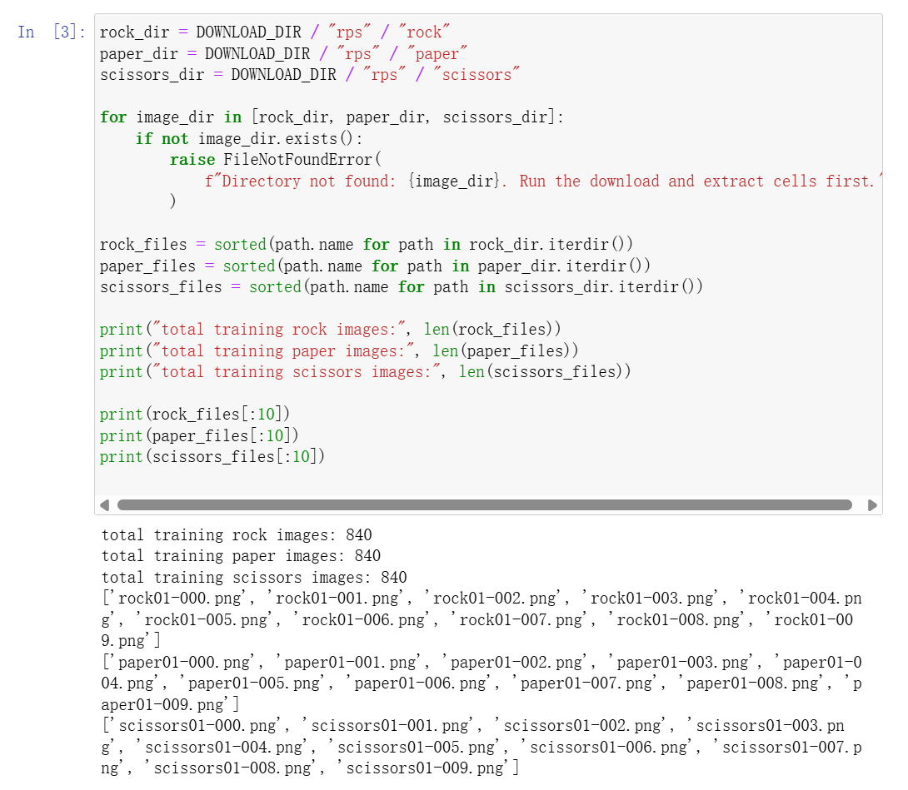
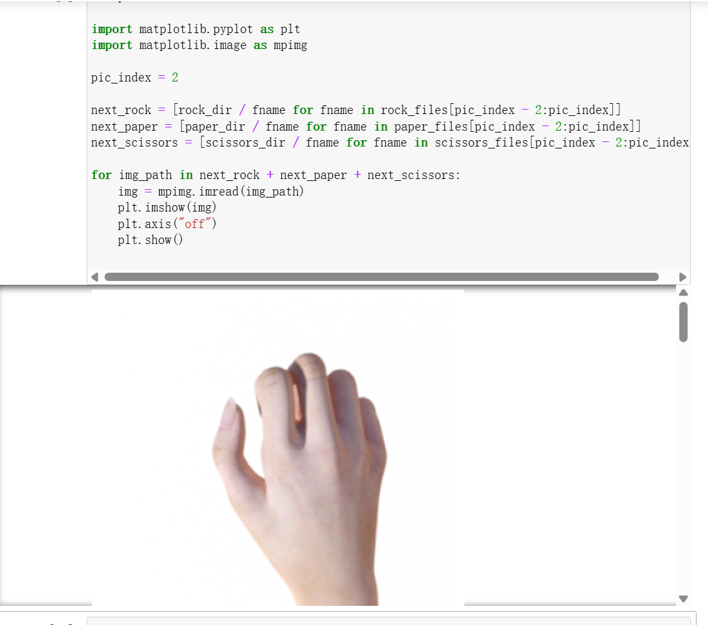
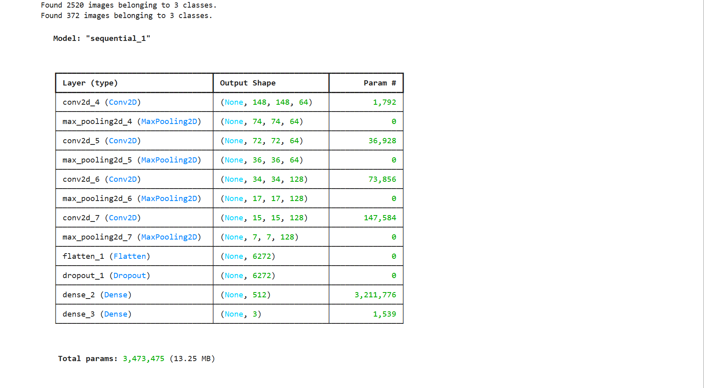
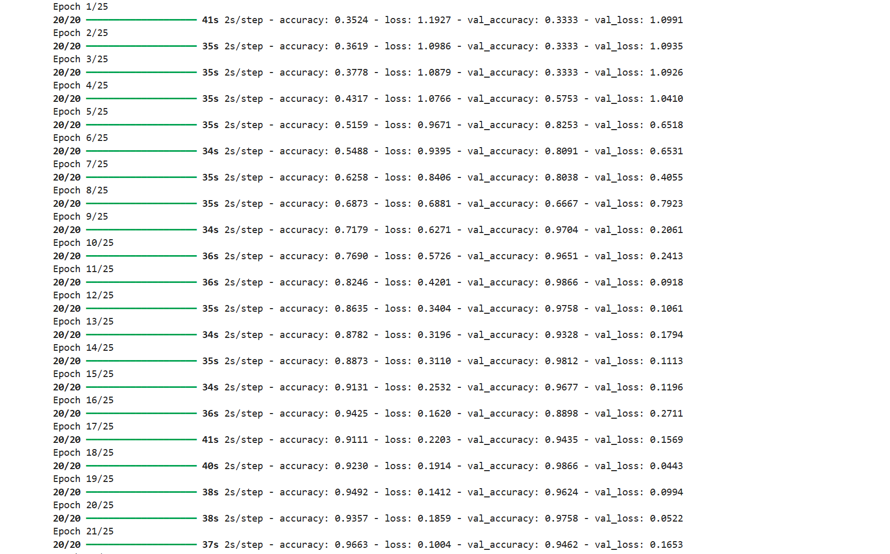
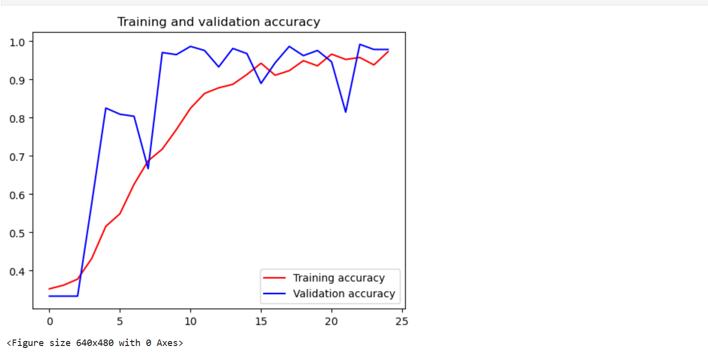

# 实验5-2：TensorFlow 石头剪刀布手势模型生成

## 一、实验目的

-   进一步掌握 TensorFlow 模型训练和生成的基本流程。
-   学会从公开数据源下载和管理图像数据集。
-   掌握使用 Keras Sequential API 构建图像分类模型。
-   学习模型训练过程中的关键步骤：数据预处理、模型编译、训练拟合。
-   掌握模型性能评估方法，通过可视化图表验证模型效果。

## 二、实验环境

### 2.1 软件环境

-   **操作系统**：Windows 
-   **开发工具**：Jupyter Notebook 
-   **Python 版本**：3.8 ~ 3.10
-   **深度学习框架**：TensorFlow 2.x / Keras

### 2.2 依赖库

```bash

pip install tensorflow\==2.13.0
pip install numpy matplotlib pillow
```

### 2.3 数据集

-   **训练集**：[https://storage.googleapis.com/learning-datasets/rps.zip](https://storage.googleapis.com/learning-datasets/rps.zip)
-   **测试集**：[https://storage.googleapis.com/learning-datasets/rps-test-set.zip](https://storage.googleapis.com/learning-datasets/rps-test-set.zip)

## 三、实验内容与步骤

下载数据集
```python
import ssl
from pathlib import Path
from urllib.error import URLError
from urllib.request import urlopen

DOWNLOAD_DIR = Path("D:/sy/sy5_2")
DOWNLOAD_DIR.mkdir(parents=True, exist_ok=True)

RPS_URL = "https://storage.googleapis.com/learning-datasets/rps.zip"
RPS_TEST_URL = "https://storage.googleapis.com/learning-datasets/rps-test-set.zip"
RPS_ZIP = DOWNLOAD_DIR / "rps.zip"
RPS_TEST_ZIP = DOWNLOAD_DIR / "rps-test-set.zip"

def download_file(url, destination):
    if destination.exists() and destination.stat().st_size > 0:
        print(f"File already exists, skipping: {destination}")
        return

    temp_path = destination.with_suffix(destination.suffix + ".part")
    print(f"Downloading: {url}")

    try:
        response = urlopen(url, timeout=120)
    except URLError:
        context = ssl._create_unverified_context()
        response = urlopen(url, timeout=120, context=context)

    with response, temp_path.open("wb") as file:
        while True:
            data = response.read(1024 * 1024)
            if not data:
                break
            file.write(data)

    temp_path.replace(destination)
    size_mb = destination.stat().st_size / 1024 / 1024
    print(f"Downloaded: {destination} ({size_mb:.1f} MB)")

download_file(RPS_URL, RPS_ZIP)
download_file(RPS_TEST_URL, RPS_TEST_ZIP)

```

解压下载的数据集

```python
import zipfile

def extract_zip(zip_path, extract_dir):
    if not zip_path.exists():
        raise FileNotFoundError(f"Zip file not found. Run the download cell first: {zip_path}")

    with zipfile.ZipFile(zip_path, "r") as zip_ref:
        bad_file = zip_ref.testzip()
        if bad_file is not None:
            raise zipfile.BadZipFile(
                f"Zip file looks corrupted at {bad_file}. Delete {zip_path} and download again."
            )
        zip_ref.extractall(extract_dir)

    print(f"Extracted: {zip_path} -> {extract_dir}")

extract_zip(RPS_ZIP, DOWNLOAD_DIR)
extract_zip(RPS_TEST_ZIP, DOWNLOAD_DIR)
```

检测数据集的解压结果，打印相关信息。

```python
rock_dir = DOWNLOAD_DIR / "rps" / "rock"
paper_dir = DOWNLOAD_DIR / "rps" / "paper"
scissors_dir = DOWNLOAD_DIR / "rps" / "scissors"

for image_dir in [rock_dir, paper_dir, scissors_dir]:
    if not image_dir.exists():
        raise FileNotFoundError(
            f"Directory not found: {image_dir}. Run the download and extract cells first."
        )
```


各打印两张石头剪刀布训练集图片

```python
%matplotlib inline

import matplotlib.pyplot as plt
import matplotlib.image as mpimg

pic_index = 2

next_rock = [rock_dir / fname for fname in rock_files[pic_index - 2:pic_index]]
next_paper = [paper_dir / fname for fname in paper_files[pic_index - 2:pic_index]]
next_scissors = [scissors_dir / fname for fname in scissors_files[pic_index - 2:pic_index]]

for img_path in next_rock + next_paper + next_scissors:
    img = mpimg.imread(img_path)
    plt.imshow(img)
    plt.axis("off")
    plt.show()
```



调用TensorFlow的keras进行数据 模型 的训练和评估。Keras是开源人工神经网络库，TensorFlow集成了keras的调用接口，可以方便的使用。

```python
import tensorflow as tf
import keras_preprocessing
from keras_preprocessing import image
from keras_preprocessing.image import ImageDataGenerator

TRAINING_DIR = "D:/mldownload/rps/"
training_datagen = ImageDataGenerator(
      rescale = 1./255,
	    rotation_range=40,
      width_shift_range=0.2,
      height_shift_range=0.2,
      shear_range=0.2,
      zoom_range=0.2,
      horizontal_flip=True,
      fill_mode='nearest')

VALIDATION_DIR = "D:/mldownload/rps-test-set/"
validation_datagen = ImageDataGenerator(rescale = 1./255)

train_generator = training_datagen.flow_from_directory(
	TRAINING_DIR,
	target_size=(150,150),
	class_mode='categorical',
  batch_size=126
)

validation_generator = validation_datagen.flow_from_directory(
	VALIDATION_DIR,
	target_size=(150,150),
	class_mode='categorical',
  batch_size=126
)

model = tf.keras.models.Sequential([
    # Note the input shape is the desired size of the image 150x150 with 3 bytes color
    # This is the first convolution
    tf.keras.layers.Conv2D(64, (3,3), activation='relu', input_shape=(150, 150, 3)),
    tf.keras.layers.MaxPooling2D(2, 2),
    # The second convolution
    tf.keras.layers.Conv2D(64, (3,3), activation='relu'),
    tf.keras.layers.MaxPooling2D(2,2),
    # The third convolution
    tf.keras.layers.Conv2D(128, (3,3), activation='relu'),
    tf.keras.layers.MaxPooling2D(2,2),
    # The fourth convolution
    tf.keras.layers.Conv2D(128, (3,3), activation='relu'),
    tf.keras.layers.MaxPooling2D(2,2),
    # Flatten the results to feed into a DNN
    tf.keras.layers.Flatten(),
    tf.keras.layers.Dropout(0.5),
    # 512 neuron hidden layer
    tf.keras.layers.Dense(512, activation='relu'),
    tf.keras.layers.Dense(3, activation='softmax')
])


model.summary()

model.compile(loss = 'categorical_crossentropy', optimizer='rmsprop', metrics=['accuracy'])

history = model.fit(train_generator, epochs=25, steps_per_epoch=20, validation_data = validation_generator, verbose = 1, validation_steps=3)

model.save("rps.h5")
```




ImageDataGenerator是Keras中图像 预处理 的类，经过预处理使得后续的训练更加准确。

Sequential定义了序列化的神经网络，封装了神经网络的结构，有一组输入和一组输出。可以定义多个神经层，各层之间按照先后顺序堆叠，前一层的输出就是后一层的输入，通过多个层的堆叠，构建出神经网络。

神经网络两个常用的操作：卷积和池化。由于图片中可能包含干扰或者弱信息，使用卷积处理（此处的Conv2D函数）使得我们能够找到特定的局部图像特征（如边缘）。此处使用了3X3的滤波器（通常称为垂直索伯滤波器）。而池化（此处的MaxPooling2D）的作用是降低采样，因为卷积层输出中包含很多冗余信息。池化通过减小输入的大小降低输出值的数量。详细的信息可以参考知乎回答[“如何理解卷积神经网络（CNN）中的卷积和池化？”](https://www.zhihu.com/question/49376084)。更多的卷积算法参考[Github Convolution arithmetic](https://github.com/vdumoulin/conv_arithmetic)。

Dense的操作即全连接层操作，本质就是由一个特征空间线性变换到另一个特征空间。Dense层的目的是将前面提取的特征，在dense经过非线性变化，提取这些特征之间的关联，最后映射到输出空间上。Dense这里作为输出层。

完成模型训练之后，我们绘制训练和验证结果的相关信息。

```python
import matplotlib.pyplot as plt
acc = history.history['accuracy']
val_acc = history.history['val_accuracy']
loss = history.history['loss']
val_loss = history.history['val_loss']

epochs = range(len(acc))

plt.plot(epochs, acc, 'r', label='Training accuracy')
plt.plot(epochs, val_acc, 'b', label='Validation accuracy')
plt.title('Training and validation accuracy')
plt.legend(loc=0)
plt.figure()
plt.show()
```


利用生成了模型，我们可以运行实际中的例子，例如上传石头剪头布的图片进行推测，使用model.predict。这里不做展开，后续我们利用Tensorflow Lite进行 Android APP开发时，可以很自然的利用手机自带的摄像头或者图片库进行图片输入。

## 四、实验总结

通过本次实验，我进一步掌握了以下内容：

1.  **数据集管理**  
    学会了从公开数据源下载、解压和组织图像数据集，并进行简单的数据探索。
2.  **数据预处理与增强**  
    掌握了使用 `ImageDataGenerator` 进行数据归一化和数据增强（旋转、平移、翻转等），有效防止过拟合。
3.  **模型构建**  
    使用 Keras Sequential API 构建了多层卷积神经网络（CNN），理解了卷积层、池化层、Dropout 层的作用。
4.  **模型编译与训练**  
    掌握了 `compile()` 中损失函数、优化器、评估指标的选择，以及 `fit()` 中训练轮数和验证数据的配置。
5.  **模型评估**  
    学会了绘制训练曲线来监控模型训练过程，判断是否存在过拟合或欠拟合。
6.  **模型导出**  
    将训练好的模型导出为 `.h5` 和 `.tflite` 格式，为后续移动端部署做好准备。

通过本次实验，我深化了对 TensorFlow/Keras 训练图像分类模型的理解。识别石头剪刀布手势虽然是一个相对简单的任务，但涉及的流程（数据预处理 → 模型构建 → 训练 → 评估 → 导出）与复杂项目完全一致，为后续更复杂的模型训练奠定了坚实基础。

## 五、参考资料

-   [TensorFlow 官方文档](https://www.tensorflow.org/)
-   [Keras API 参考](https://keras.io/api/)
-   [TensorFlow Lite 转换指南](https://www.tensorflow.org/lite/models/convert)
-   [ImageDataGenerator 文档](https://www.tensorflow.org/api_docs/python/tf/keras/preprocessing/image/ImageDataGenerator)

## 六、附件与代码仓库

-   本实验完整 Jupyter Notebook 已上传至 GitHub：  
      [https://github.com/bukuujun/rk3/tree/master/sy5_2](https://github.com/bukuujun/rk3/tree/master/sy5_2)